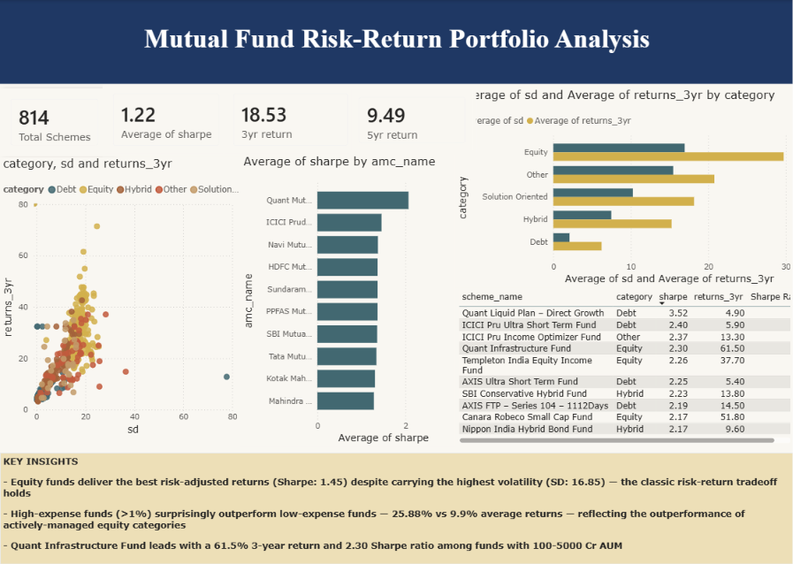

# 💰 Mutual Fund Risk-Return Portfolio Analysis

> An Excel + SQL + Power BI project analyzing 814 Indian mutual fund schemes to identify optimal risk-adjusted investment opportunities.

---

## 📌 Problem Statement

Investors often struggle to balance risk and return when selecting mutual funds, and commonly rely on absolute returns alone without considering risk-adjusted performance. This project analyzes 814 mutual fund schemes across categories (Equity, Debt, Hybrid, Solution Oriented, Other) to identify which funds and categories deliver the best risk-adjusted returns.

---

## 🛠️ Tech Stack

| Tool | Purpose |
|------|---------|
| **Excel (Google Sheets)** | Pivot tables, QUERY formulas, data validation, and charts |
| **SQL (SQLite)** | CTEs, Window Functions, JOINs, and category-wise aggregations |
| **Power BI** | Interactive dashboard for risk-return visualization |

---

## 🔍 Project Workflow

1. **Excel Analysis** — Built pivot tables comparing risk (Standard Deviation) and return across fund categories; used QUERY formulas to identify top 10 risk-adjusted funds; validated data quality (missing values check)
2. **SQL Analysis** — Loaded data into SQLite and built:
   - Category-wise risk-return aggregations
   - `RANK() OVER (PARTITION BY category)` to find top 3 funds per category
   - `JOIN` with a custom risk-level lookup table
   - `CASE WHEN` logic to analyze expense ratio impact on returns
   - AMC (fund house) performance comparison
3. **Power BI Dashboard** — Consolidated findings into an interactive, stakeholder-ready dashboard

---

## 📊 Key Findings

| Insight | Detail |
|---------|--------|
| 📈 **Risk-Return tradeoff holds** | Equity funds carry the highest risk (SD: 16.85) but also the highest returns (29.64%) and best Sharpe ratio (1.45) |
| 🛡️ **Debt funds = stability** | Lowest risk (SD: 1.94) but modest returns (5.81%) — suited for conservative investors |
| 💸 **Expense ratio ≠ worse returns** | Counter-intuitively, high-expense funds (>1%) averaged 25.88% returns vs. just 9.9% for low-expense funds — likely reflecting actively-managed equity funds' outperformance |
| 🏆 **Top individual fund** | Quant Infrastructure Fund — Sharpe 2.3, 61.5% 3-year return |
| 🏢 **Best fund house** | Quant Mutual Fund — highest average Sharpe ratio (2.07) among AMCs with 10+ schemes |

---

## 📈 Dashboard Preview

---

## 📁 Repository Structure

├── data/
│ └── comprehensive_mutual_funds_data.csv # Raw dataset
├── excel/
│ └── mutual_fund_analysis.xlsx # Pivot tables, QUERY formulas, charts
├── sql/
│ ├── queries.sql # All SQL queries
│ └── mutual_fund.db # SQLite database
├── mutual_fund_dashboard.pbix # Power BI dashboard
└── README.md

---

## 📂 Dataset Source

[Kaggle — Mutual Funds India: Detailed](https://www.kaggle.com/datasets/ravibarnawal/mutual-funds-india-detailed)
